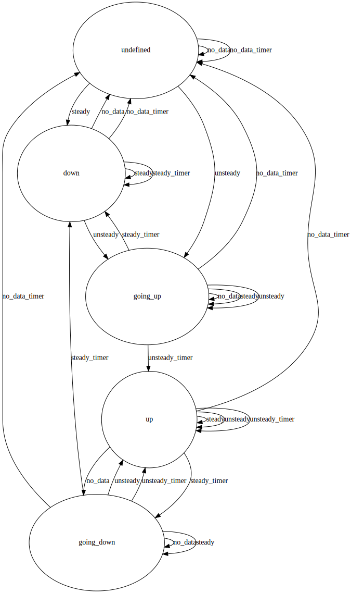

# hls-await

This is a work-in-progress monitor for [HLS](https://en.wikipedia.org/wiki/HTTP_Live_Streaming) streams
to detect activity via [perceptual hashing](https://en.wikipedia.org/wiki/Perceptual_hashing).

Currently it monitors a feed of [North Korea TV](https://kcnawatch.org/korea-central-tv-livestream/)
and [posts screencaps to Twitter](https://twitter.com/KCTV_bot).

## Features / TODO

- [ ] [Roku Stream Tester](http://devtools.web.roku.com/stream_tester/html/index.html) launching *partially*
    - [x] HTTP cache for segments *saves bandwidth*
- [x] Twitter
    - [ ] Command via DM *Increases rate, kill switch, change perceptual hashing threshold*
    - [ ] Resume threads on restart.
- [x] Process separation of ffmpeg / CGO. *This deserves a writeup!*
    - [Passing FDs over Unix sockets](https://github.com/mindreframer/golang-stuff/blob/master/github.com/youtube/vitess/go/umgmt/fdpass.go)
    - [Internals of Go's new fuzzing system](https://jayconrod.com/posts/123/internals-of-go-s-new-fuzzing-system) - example of how to use a child process as an rpc service
- [x] Find the most interesting images *avoid blank screens*
- [x] Tweak the perceptual hash thresholds
- [x] Revise the clunky FSM code.
- [x] [Test pattern detection](https://twitter.com/KCTV_bot/status/1496722859904978948)

## State Machine

